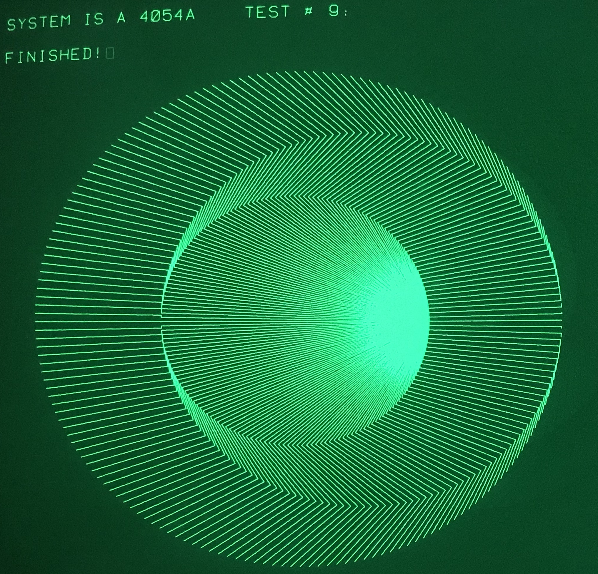
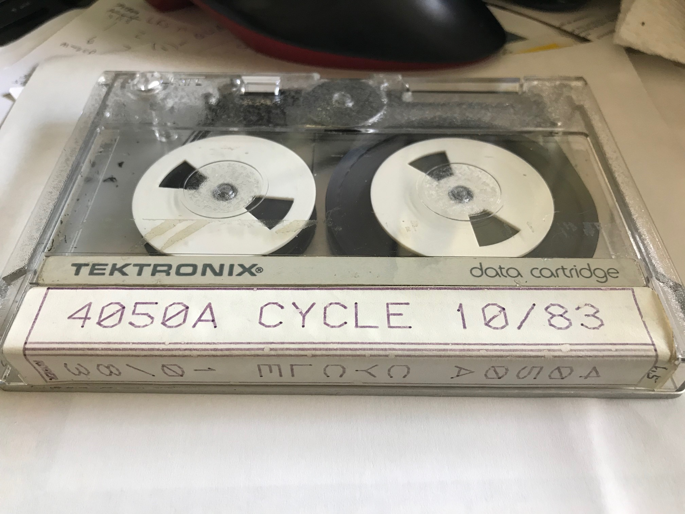

This is one of two Tektronix tapes labeled "4050A CYCLE 10/83" that I received from Stan Griffiths in 2000 in a box of old 4050 series tapes.
The files I recovered are from the tape with a hand written 1.5 on the top of end of the label.
Both tape labels were plotted and both had "ROGER" at the bottom of the end of the label.

The comments in the program indicate these tapes were used to test 4050 computers for about one hour.

The recovered program would only work on a Tektronix 4052A or 4054A as it made a CALL MTPACK command to the tape and that call is only built into the 4052/4054 and A-series computers.

**This folder includes the original program and my modified program which runs on all 4050 computers and only runs the 9 display tests.**
----
My youtube video running the modified program with display tests is here:

***https://www.youtube.com/watch?v=0oTmPI5YaJU


---

Interestingly the program includes a set of BASIC statements to detect the specific model (4051/4052 or 4054) and sets a parameter to scale a FOR/NEXT loop time delay to 1 second.
---------
These data statements indicate the relative timing of the 4052/4054 FOR/NEXT is about 8.3X and the 4052A/4054A FOR/NEXT is about 7.0X the speed of the 4051.

I$ is the model name which is used in the print statements and written to the tape
S9 in the data is the time constant used in the program for a 1 second delay.
T1 is the RND(-1) first returned value, which is model specific
```
210 DATA "4051  ",217,0.196324846518
220 DATA "4052  ",1805,0.706280095237,"4052A ",1516,0.796364876486
230 DATA "4054  ",1805,0.88093139039,"4054A ",1516,0.894514130768
240 DATA "4054  ",1805,0.505007490939,"4054A ",1516,0.590965583259
250 READ I$,S9,T1
```


The complete tapedump of the four files on this tape is also in this folder.
The dump includes all the Tektronix control characters - so use Notepad++ to view the entire file.

File 2 indicates this tape was run on a 4052A that failed on PASS 16
```
4052A SERIAL: # B045936  IN: 14.3.15   PASS:  16   FAILED
```
The test program included checking BASIC ROM CRC values - apparently provided from a Factory Memory Test ROMPACK - as CALL "MEMORY" in the program is not standard in the 4052/4054 or my 4054A.

The program provides 4052/4054 v4.4 and 4052A/4054A v1.4 CRC tables - but I don't understand all the values.
I've commented after the data statements which ROMs match the DATA statements - from the Diagnostic ROM Pack CRC tables.
Apparently the first two parameters are starting and ending addresses for either the EVEN ROM or the ODD ROM (0 or 1 as last address nibble).

```
2930 REM ***4052/54 V4.4 CRCS*** With patch
2940 RESTORE 2950
2950 DATA "C N 4601 4801 5440"
2960 DATA "C N 4600 4800 B0DB"
2970 DATA "C N 4401 4601 A7E3"
2980 DATA "C N 4400 4600 AEED"  U893
2990 DATA "C N C001 FF01 8AF0"  
3000 DATA "C N C000 FF00 3BC5"
3010 DATA "C N 8001 C001 3FE5"  U880
3020 DATA "C N 8000 C000 7403"  U825
3030 DATA "C N 4801 8001 95BC"  U870B
3040 DATA "C N 4800 8000 00F1"  U820B
3050 DATA "C N 4001 4401 7132"  U870A
3060 DATA "C N 4000 4400 3EAB"  U820A
3070 DATA "C N E001 FF01 1F38"  U893
3080 DATA "C N E000 FF00 5B67"  U810
3090 DATA "C O 0000 2000 2435"
3100 DATA "C O 0000 2000 844A"
3110 DATA "C O 2000 4000 21D8"
3120 DATA "END"

3130 REM ***4052A/54A V1.4 CRCS***
3140 RESTORE 3150
3150 DATA "C G E000 FF00 68DF"  U810
3160 DATA "C G E001 FF01 7F39"  U893
3170 DATA "C G 4000 8000 F696"      U820A?
3180 DATA "C G 4001 8001 DA3C"      U870A?
3190 DATA "C G 8000 C000 7DDF"  U825
3200 DATA "C G 8001 C001 59EE"  U880
3210 DATA "C G C000 FF00 B463"      
3220 DATA "C G C001 FF01 7117"
3230 DATA "C G 0000 4000 C8A7"
3240 DATA "C G 0001 4001 9E0D"
3250 DATA "C O 0000 2000 2435"
3260 DATA "C O 0000 2000 844A"
3270 DATA "C O 2000 4000 21D8"
3280 DATA "END"
```
