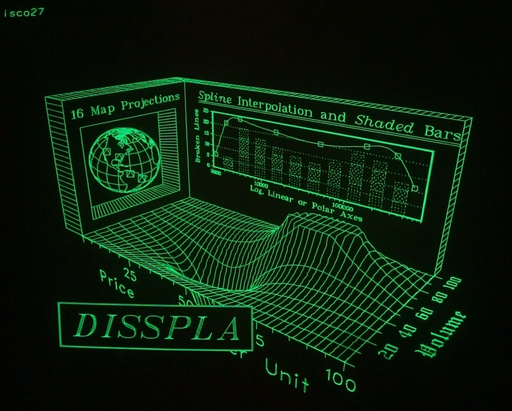

Tektronix 4050 PLOT10 to R12 Viewer and Creator programs and data files
-------------

There are three programs in this folder: file 1 - The viewer program which will display each image and pause for five seconds between images. file 6 - The PLOT10 plt file to R12 BINARY data file conversion program file 7 - The Michael D Cranford 4051 RAMPACK .dat ASCII Fast Graphics file format to R12 BINARY file format conversion program

The Viewer and file 7 will run on any 4051 with RAMPACK or vintagetek.org MAXIROM or any 4052/4054 with Jos Dreesen's 4052/4054 Multifunction ROM Pack programmed to include the 4052R12 ROM. File 6 takes advantage of the 4052R14 GPIB Enhancement ROM Pack - which is also included in the 4051 MAXIROM from vintagetek.org, but it would be easy to add the HEXDEC with a couple of lines of BASIC.
I posted youtube videos running this program on my 4052 and 4054A: 

https://youtu.be/rhM8QvVUHxk 
----

https://youtu.be/2SbCIP1m6hs
----
Background:

Tektronix introduced the PLOT10 vector graphics format with their 4010 Vector Graphics Terminal with 1024x780 vector resolution on a 10-inch storage tube display in 1972.
Mainframe and minicomputers added support for transmitting the PLOT10 vector graphics format files over RS-232 serial to the 4010/4012/4014 terminals.

Tektronix introducted the 4051 vector graphics microcomputer with a Motorola 6800 CPU in 1975 with BASIC in ROM. The 4051 Option1 Serial Interface added BASIC ROM support including PLOT10 capability.

I have the serial interface on my 4052 and 4054A computers and transmitted several PLOT10 plt files to my computers, but even with 9600 baud, the larger files take many minutes to draw.

My PLOT10 to R12 program takes advantage of the 10x speedup of graphics on the 4051 with the Fast Graphics ROM Pack included with the MDC RAMPACK or the vintagetek.org MAXIROM.  These programs also work with the 4052 and 4054 computers that have 4052R12 ROM Packs or Jos Dreesen's 4052/4054 Multifunction ROM Pack with R12 ROMs programmed.
----

I had been working on this PLOT10 to R12 format converter program when I got my 'new' 4054A computer with Option 30 in 2022 at VCF West in Mountain View, CA.

I tried to convert the 55KB icmask.plt file on my 4054A - and it took a couple of hours and still had bugs in the create program. I kept the Option 31 Color Dynamic Graphics screen on during that entire time and got burn in on my 'new' computer screen :(

I just got back to working on the PLOT10 plt file to R12 file format converter last week and decided on a new approach for the program to solve the following issues: 

1 - Many of the plt files on the Chuck Forsberg demo video were larger than the 32KB of memory in the 4051 and some were larger than the 64KB program on the 4052 and 4054. 

2 - the conversion program was taking hours on my 4054A to load the plt data from my PC over serial to the 4054A at 9600 baud and convert the commands to R12 format for the 55KB icmask.plt 

3 - the PLOT10 plt file format for vector graphics includes ASCII control characters - which are problematic for serial transfer to the 4050 computer AND to the converter program parsing the commands.

My approach to work around the issues above: 

1 - Divide the plt file into 16KB 'chunks' so each chunk could be loaded into memory and processed by the converter - even on a 4051 computer with 32KB RAM! 

2 - Use the 405x Emulator (actually just 4051 compatible) and increase the speed of the 6800 emulation by 100X!! The experimental version of the Emulator supports the 4051 Fast Graphics/R12 ROM. 

3 - Use HxD to load the plt file and export as S19 ASCII HEX format if the plt file is <32KB or S28 if the plt file is >32KB

I edited the exported S19 or S28 ASCII HEX file with Notepad++, which takes less than 10 minutes - although the converter program could have used the S19 or S28 output - it would have just been slower with more data to process.

File 6 is the program to convert a PLOT10 .plt file to an R12 image for the viewer program.
