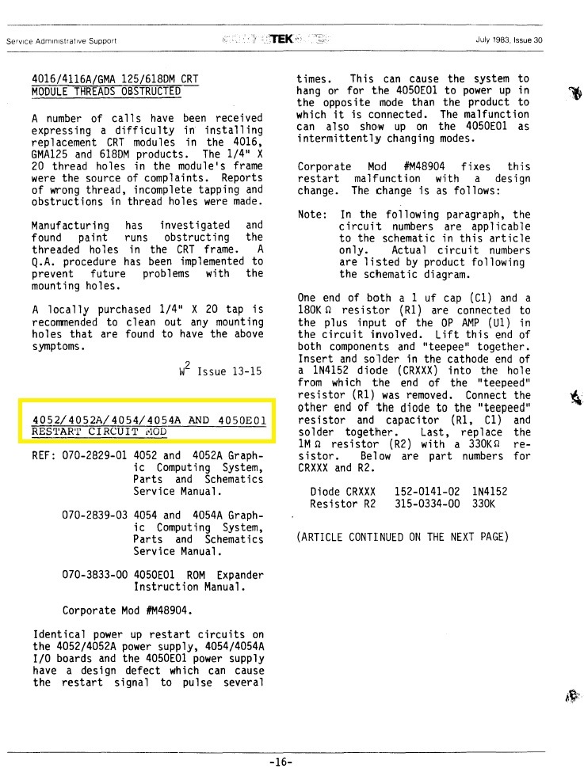

Notes above found in Service TekNotes posted on w140.com/tekwiki/wiki/Tektronix_Magazines
-------
I extracted the notes I found as pdfs in this folder for Tektronix 4051 4052 4054 4052A and 4054A.

I created separate service note folders for 4907, 4662 and 4041 service notes

Here is an example page from one of the notes:

