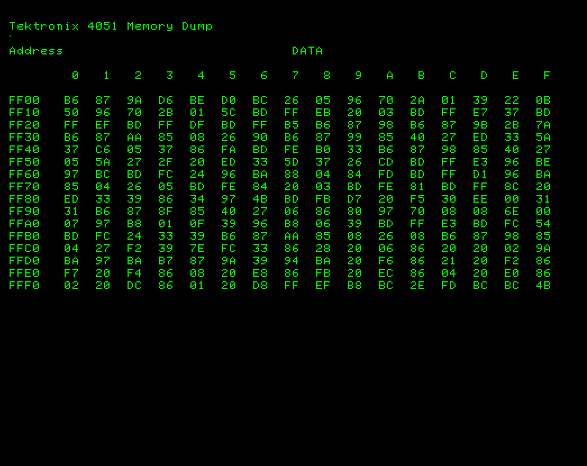

The 4051 Assembler program and documentation were from Tekniques Vol 7 No 4 T1 tape
---
I've posted the documentation file and the program files in this folder with sample assembly source files.
---
The assembler includes a DDT debugger assembly program
--- 
The documentation includes 4051 BASIC ROM Entry points and other 4051 assembly instructions

Screenshot below is output from Tek 4051 web-browser emulator running my 4051 Memory Dump program displaying page FF which is the last page in the 4051 BASIC ROM.

