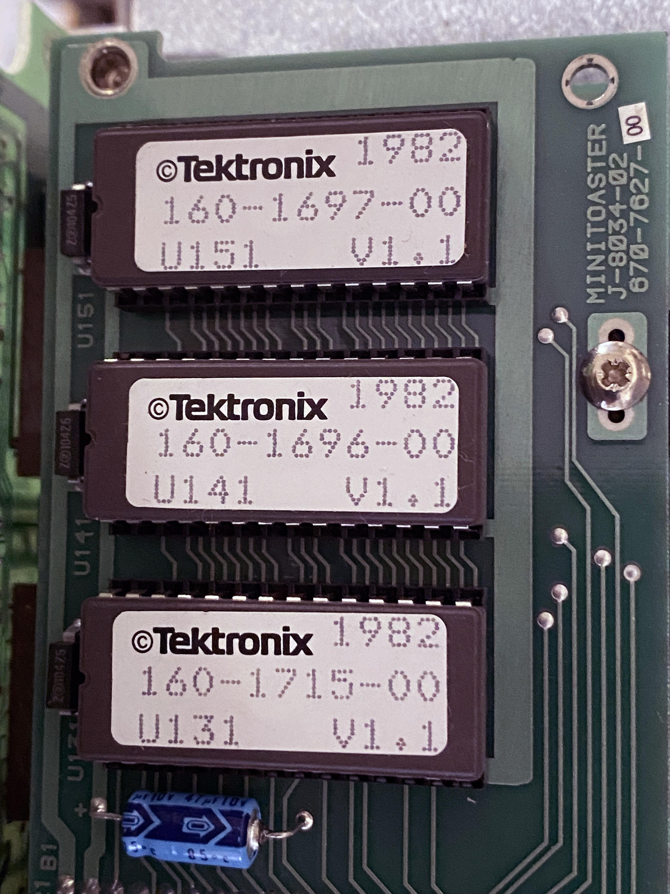

# Tektronix 4052-4054 Extended Memory File Manager

This was an Option 27 (256KB) or Option 28 (512KB) Extended Memory File Manager for the 4052, 4052A, 4054 and 4054A graphics computers.   

The 4052A/4054A had data access speed up to 400KB per second!
The 4052 and 4054 with this option achieved memory access speed up to 50KB per second.

This option required the 4-slot ROM Backpack and also included the RS-232 Data Communications interface.

This option provided non-volatile file storage to the 4052A or 4054A computers with battery backup - for a minimum of 4 hours after the computer was unplugged or lost power.

The Extended Memory File Manager commands are a subset of the Tektronix 4907 Floppy Disk File Manager commands.
Built-in Diagnostic commands provide a power-up test and more thorough Extended Memory test.

This folder includes the three Extended Memory File Manager ROM images.

