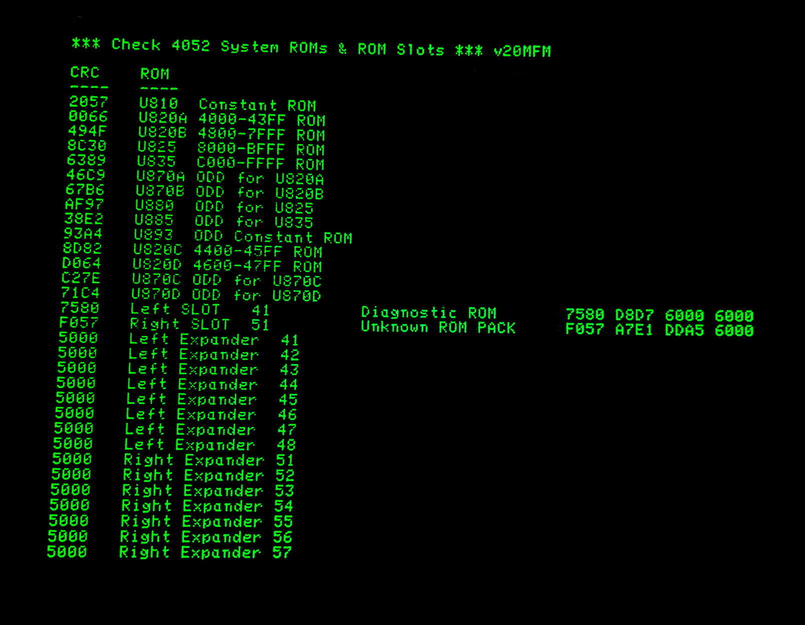
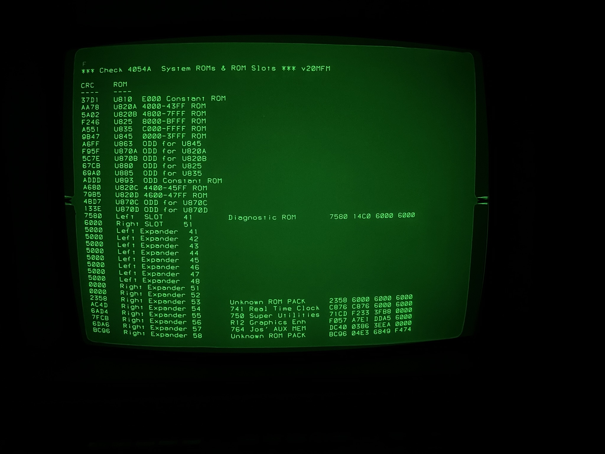

This BASIC program requires the 4052/4054 Diagnostic ROM Pack.
This ROM Pack diagnoses bad memory and bad ROMs so you can repair your computer.

Jos Dreesen has designed a replacement since this ROM Pack is so rare.
See Jos' post if you would like to purchase his ROM Pack:

https://forum.vcfed.org/index.php?threads/tektronix-4052-54-diagnostic-rom-pack-remade.63974/

This program uses the CALL "CRC" command to the Diagnostic ROM Pack and returns the CRC for the specified block of ROM memory.

I used trial and error to discover the correct bank address and length to display the CRC to match the output of the Diagnostic ROM Pack at power on.
I also discovered how to set the bank address and length to display the 4050 ROM Expander slots - which also works with Jos Dreesen's 4052/4054 Multifunction ROM Pack which emulates the 4050 ROM Expander which holds up to eight 4052/4054 Option ROMs and adds the Tektronix RS-232 Printer Interface and the TransEra Real-Time-Clock!  See this post for more info: 
https://forum.vcfed.org/index.php?threads/tektronix-4052-4054-multifunction-modules-available.76192/

Each 4052/4054 Option ROM Pack can contain up to four 4KB EPROMs, so my program calculates and displays 4KB checksums for each of those ROMs.

