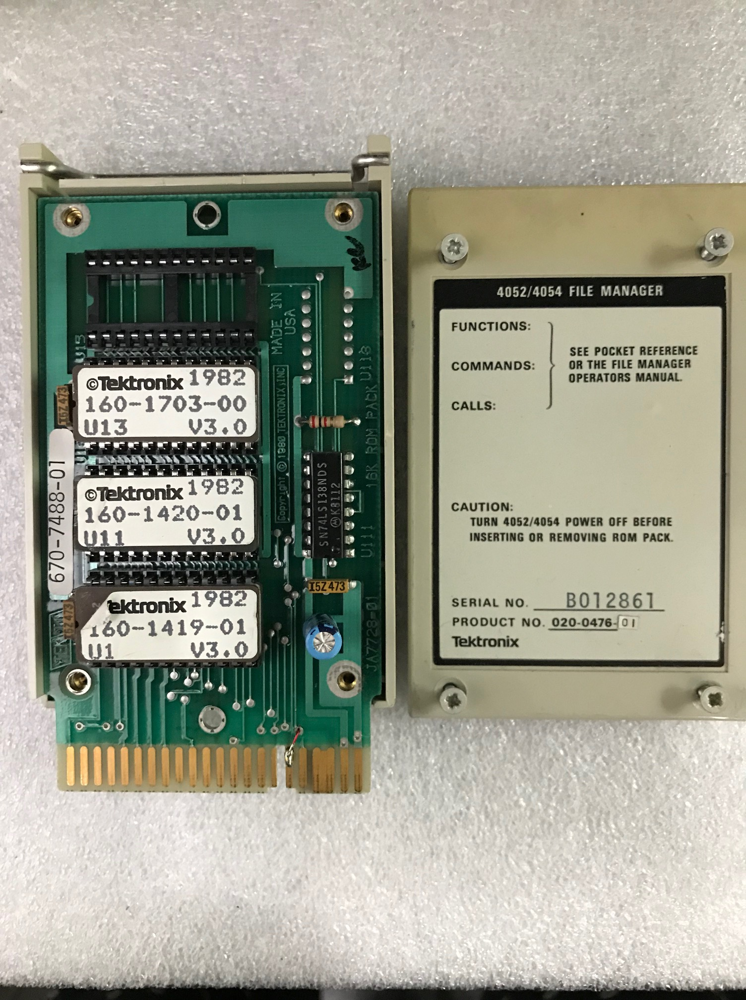

My **4052/4054 File Manager 020-0476-01 ROM Pack** contained three Intel 2732A 4KB EPROMs. 
Apparently the -01 firmware needed 512 more bytes than the 8KB ROM in the -00 File Manager.
This is the File Manager ROM I am using with my 4907.

I used HxD to import the .MOT (Motorola format 82), and save each of the three files as a .BIN file. 
****
Updated U13 binary - old U13 had corrupt image with a stuck databit.  Oct 17 2020
***

