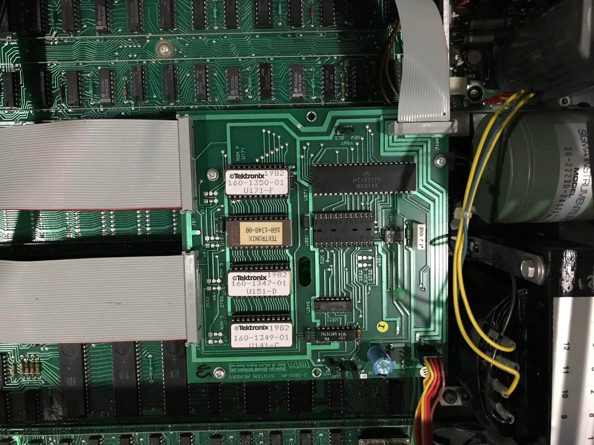

These are the ROMs in my 4662 Plotter.  They are on the System Memory Board and are the -01 Version
All the ROM sockets on the original mainboard are now empty.

This System Memory board also has the interface connector on the top right of the photo to the Opt 31 multi-pen changer

