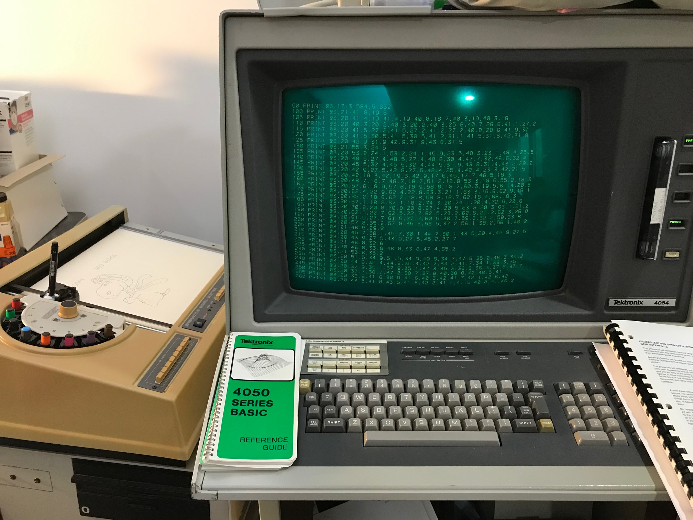

This folder contains Tektronix 4662 plotter information
-----

My 4662 plotter pen adapter 3D STL files allow you to use a Faber Castell Pitt Artist Pen or Staedtler HP Plotter Pens - see my photos for part numbers of the pens
-------
Here is a photo of my 4662 plotter after plotting the Snoopy the Red Baron from my Tektronix 4054A computer

