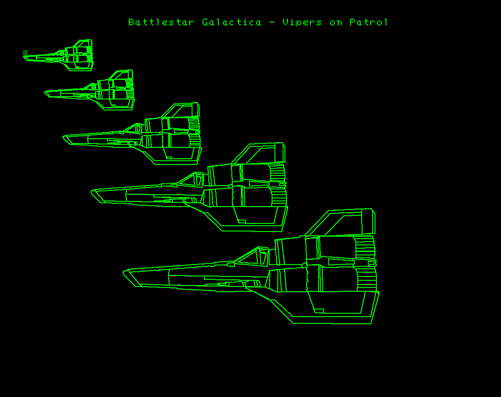

# Be sure to check out my 2025 Battlestar Galactica 1978 DEMO CGI scenes - just click the link

[https://github.com/mmcgraw74/Tektronix-4051-4052-4054-Program-Files/tree/master/Battlestar_Galactica-and_Tektronix_4051/Battlestar_Galactica_Demo_2025]

.jpg)

# Battlestar Galactica 1978 TV Series featured Tektronix 4051 computers

**************
I created a BASIC program for my 4052 and 4054 computers in 2000 showing Battlestar Galactica "Vipers on Patrol"

I had found an internet article on the James Willing "Computer Garage" website www.computergarage.org/Garage/j-media.shtml#Movies (now on archive.org)
that had a photo of a plot of Vipers on patrol (below).  

I digitized the Colonial Viper from printing the plot on this website in January 2000.  I then wrote a Tektronix 4050 BASIC program to digitize the largest Viper using a Tek 4662 plotter with digitizing `pen` with the plotter connected to my Tektronix 4052 computer.

Next I wrote my original Viper BASIC program for my Tektronix computers and used an ASCII DATA file for the X/Y vectors.

In 2018, I discovered the vintage computer federation website vcfed.org and a couple of forum members had developed a 4051 emulator in javascript.  This emulator did not support accessing a separate DATA file, so I modified my Viper program to embed the data in BASIC DATA statements in 2018.

I've posted my Vipers 2018 version and my latest 2023 version that uses Tektronix R12 option ROM for Fast Graphics in the Battlestar folder.

The 2018 version of Vipers takes 58 seconds to draw the five Vipers on the screen different sizes.

The 2023 R12 version of Vipers on the latest 4051 Emulator which adds R12 Option ROM and emulates my GPIB Flash Drive for program and data file support only takes 3.6 seconds to load and draw all five Vipers for a 16X speedup on the same 4051 Emulator (or 4051 computer)!

**************
The Tektronix 4051 vector graphics personal computer (introduced 1975) had state-of-the-art high resolution graphics and was featured in the original Battlestar Galactica TV Series.

**************
Here is one of the scenes featuring the use of a 4051 computer by Athena.

She was asked to get a list of the some of the prisoners on the prison barge.

Here is a screenshot of her 4051 computer screen with the list.

She then pressed the Hard Copy button on the 4051 keyboard and got a print from the Tektronix 4631 Hard Copy Unit in a couple of seconds!

She then examined the printout before handing it to Colonel Tigh.

***************
The photo below is my Cylon Attack game for 4054/4054A with Option 30 Dynamic Graphics coprocessor board!

In addition I ported my Cylon Attack game to all 4051, 4052, 4054 computers with Fast Graphics/R12 ROM Pack.
