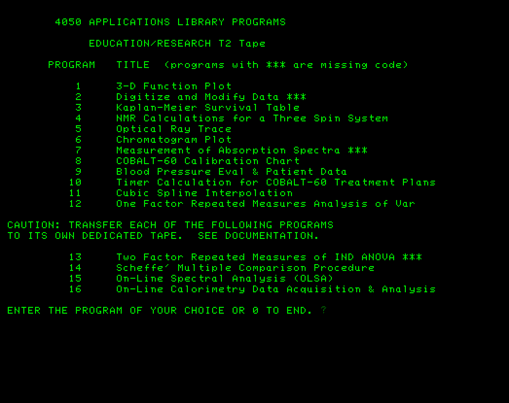

# EDUCATION/RESEARCH Tape2

In Tektronix Tekniques Vol.5 No.3 newsletter in September 1981, they announced that the number of 4050 BASIC application programs submitted to the Application Library had grown to over 200 and the Applications Library team had decided to stop creating custom tapes with three selected programs for each application program submitted and consolidate some of the top applications that had been submitted into separate tapes with Abstracts for each tape published in an Application Library Programs catalog.  

Here is a list of the tapes in the 1981 Application Library catalog.
T1 and T2 are quarter-inch cartridge tapes (capacity 300KB)
D1 and D1 are eight-inch Floppy disks (capacity 600KB)

1. Character Generator T1
2. Education/Research T1

**3. Education/Research T2**

4. Electrical Engineering T1
5. Graphing T1
6. Graphing T2
7. Graphing T3
8. Graphing D1
9. Graphing D2
10. Interfacing T1
11. Mapping T1 ...
12. Mechanical Engineering
13. Programming Aids T1
14. Programming Aids T2
15. Project Aids T1
16. Project Aids D1
17. Recreational Plots T1
18. Slidemaker T1 .
19. Slidemaker D1
20. Text Processing T1
21. Text Processing D1
22. Utilities T1
23. Utilities D1

---------
The Education/Research Tape2 was in the estate of Jack Everson, a Tektronix sales engineer in New York.

I recovered this tape in Nov 2025 after looking at the 1980 Tekniques Vol.5 No.4 Tape 1 documentation that I had previously posted (I don't have that tape)
[Tektronix_Tekniques_Vol5_No4_T1_Program_Documentation_Dec81.pdf](https://github.com/mmcgraw74/Tektronix-4051-4052-4054-Program-Files/blob/95c14ff7eff7e072417ad0c37ed56ceaa1256888/TekniquesVol5No4-T1/158082_Tektronix_Tekniques_Vol5_No4_T1_Program_Documentation_Dec81.pdf) 

I noticed several 3D function plot programs, so I began searching the Tekniques newsletters to see if they were ever published in the Applications Library Catalog and found that the General Function F(X,Y) program by Dony Roberts was published in the Tekniques Vol5 No4 T1 tape and the Education/Research Tape2 included an earlier Dony Robert 3D Function Plot program.

My process for recovering these 40 year old Tektronix 4050 tape cartridges starts with opening the cartridge, removing the broken internal drive belt, and then baking the tape in a dehydrator at 134 degrees F for 48 hours.  Then reassembling the tape after it cools to room temperature.  The Education/Research Tape2 had Dony Roberts 3D Function Plot F(X,Y) program as file 2 on the tape.  I had tape errors trying to read file 1 which is the menu program and file 2, so I changed my program to dump tapes to simply reading sequential blocks of 256 bytes and copying the results to my GPIB Flash Drive on my 4054A computer and was finally able to get data from all the files in the dump of this tape.

Then I edit the dump to extract each ASCII program and some character editing to get each program to load into my Tektronix 4051 Emulator.  I was able to recover the 3D Function Plot program and created a separate directory for that program with a screenshot of running the program and the program instructions for the newer General Function Plot program into this directory: 

[General Function Plot](https://github.com/mmcgraw74/Tektronix-4051-4052-4054-Program-Files/tree/466109406434db70894417a334b0401d3834d99b/General_Function_Plot)

---------------
I also realized that one of my 4050 program submissions to the Application Library was published in Education/Research Tape2: Cubic Spline Interpolation - Files 24, 25 and 26.

I recovered almost all the ASCII program files, but the BINARY program files were recovered as ASCII text and my attempts to convert it to BINARY programs so far have not worked.

I changed the DIRECTORY menu program file 1 to add *** after the programs that were not recovered successfully.

Here is my Tektronix 4051 Emulator screenshot of running the Directory menu program showing the programs not completely recovered.

 

--------
I have included the following files in this directory:

* EDUCATION-RESEARCH T2.zip - zip file with all the recovered programs and posted the individual programs in the PROGRAMS directory
* EDUCATION-RESEARCH_T2_Abstracts.pdf - Abstracts for each program from the 1981 Applications Library Programs catalog
* EDU-RES T2 dump.txt - all the files dumped from this tape
* EDU-RES_MENU.png - screenshot of the Tektronix 4051 Emulator running file 1 showing with *** the programs that have damaged files or BINARY files
* EDU-RES_T2 TLIST.txt - my list of the programs from extracting the headers for each file and multiplying the number of 256 byte tape blocks by 256 to form the MARKed tape file size
* PROGRAMS - individual BASIC program files on this recovered tape

