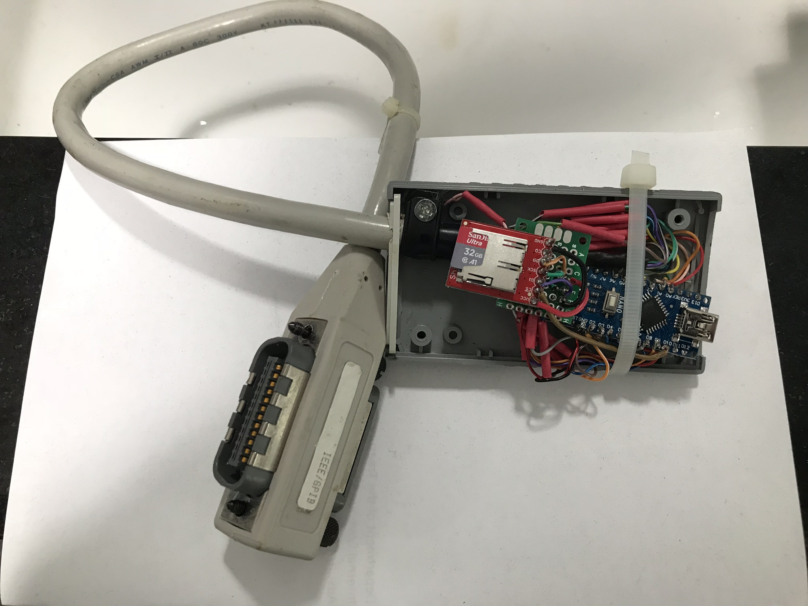

# Tektronix-4050-GPIB-Flash-Drive
Tape Drive emulator for Tektronix 4050 series (4051/4052/4054) computers using an SD (or microSD) card for storage.

The Tektronix 4050 series of computers was introduced in 1975 with the 4051 using a Motorola 6800 CPU with 32KB of BASIC in ROM and 32KB of DRAM.
These computers integrated a 12 inch direct view storage tube (DVST) for 1024x780 addressable vector graphics, keyboard, and a 3M DC300 tape drive for program storage.  

The internal tape drive in the 4051 is to the right of the display in the photo.

The external Tektronix 4924 GPIB Tape Drive is also in this photo with a GPIB cable.

In the 45 years since the introduction of the 4051 - the DC300 program tapes that have been found have been increasingly difficult to recover the original program files - as most of the tape internal drive belts have deteriorated, and in many cases damaged the oxide where they were in contact with the supply and takeup reels.

This project will create an emulator of the external Tektronix 4924 GPIB tape drive, to eliminate the need to repair the 4050 series internal tape drive, or find the rare replacement tapes - long out of production.

There are several other projects that have created similar flash drive emulators - particularly to emulate vintage floppy drives.

The Tektronix 4050 computers were introduced along with the GPIB interface - and took advantage of both primary and secondary GPIB addresses in Tektronix 4050 BASIC, which allowed many of the BASIC statements to be used not only with the internal display and tape drive, but also with external GPIB plotters and external tape drives.

One example of Tektronix primary/secondary GPIB addressing would be loading a program from internal tape versus external tape:

To load the tenth file on an internal tape:
FIND 10
OLD

To load the tenth file on an external 4924 tape drive with GPIB address 5:
FIND @5: 10
OLD @5:

The FIND @5: 10 BASIC statement resulted in a GPIB write to address 5,27 with a data value of 10, where the 27 was interpreted as the FIND command by the tape drive.

Here is a table of Tektronix 4050 BASIC GPIB Primary/Secondary addresses.

The first column shows that Tektronix used GPIB addresses beyond the standard 30 to easily address all the internal peripherals with any BASIC command:

I have underlined in yellow the GPIB secondary addresses (commands) needed for the tape emulator:

Later GPIB devices from Tektronix and other companies did not support secondary GPIB addresses and used a GPIB command-based protocol.

Therefore this project will not have broad applicability for other computers with GPIB interfaces.

----
Here is a link to my thread on vcfed.org forum for this project:

http://www.vcfed.org/forum/showthread.php?64018-Tektronix-405x-GPIB-Flash-Drive&p=518793#post518793
---
Here is the link to my github repository for Tektronix 4050 program tapes, ROM Pack firmware and a couple of documents:

https://github.com/mmcgraw74/Tektronix-4051-4052-4054-Program-Files
---
My first hardware version was based on Emanuele Girlando's Arduino GPIB sketch which can be found here:
http://egirland.blogspot.com/2014/03/arduino-uno-as-usb-to-gpib-controller.html

My first prototype of this hardware with an Arduino Nano with a microSD card and GPIB cable: 

I had to move some of the GPIB pins in Emanuele's layout to attach the microSD card to the SPI interface.

However, Emanuele's Arduino code only supports GPIB controller mode - and for my project I need the tape emulator to be a GPIB device, as the 4050 series computers must be the GPIB controller.

I recently found two additional github projects with Arduino GPIB interfaces that may help me finish my Tektronix 4050 GPIB Flash Drive project:

https://github.com/Tek-User/Tektronix-GPIB-Download

https://github.com/Twilight-Logic/AR488

This last project is the most interesting as it supports both controller mode and device mode, and also supports several types of Arduino boards.
