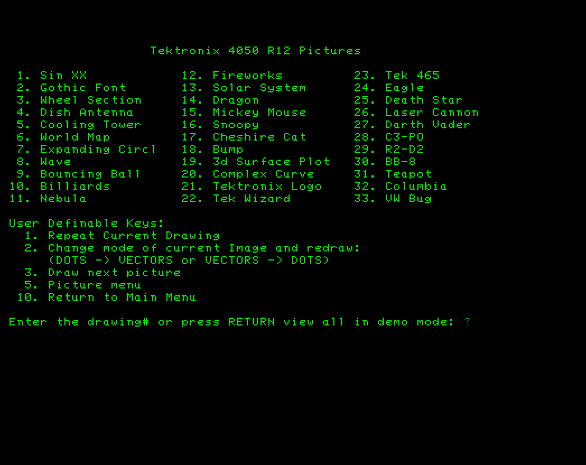
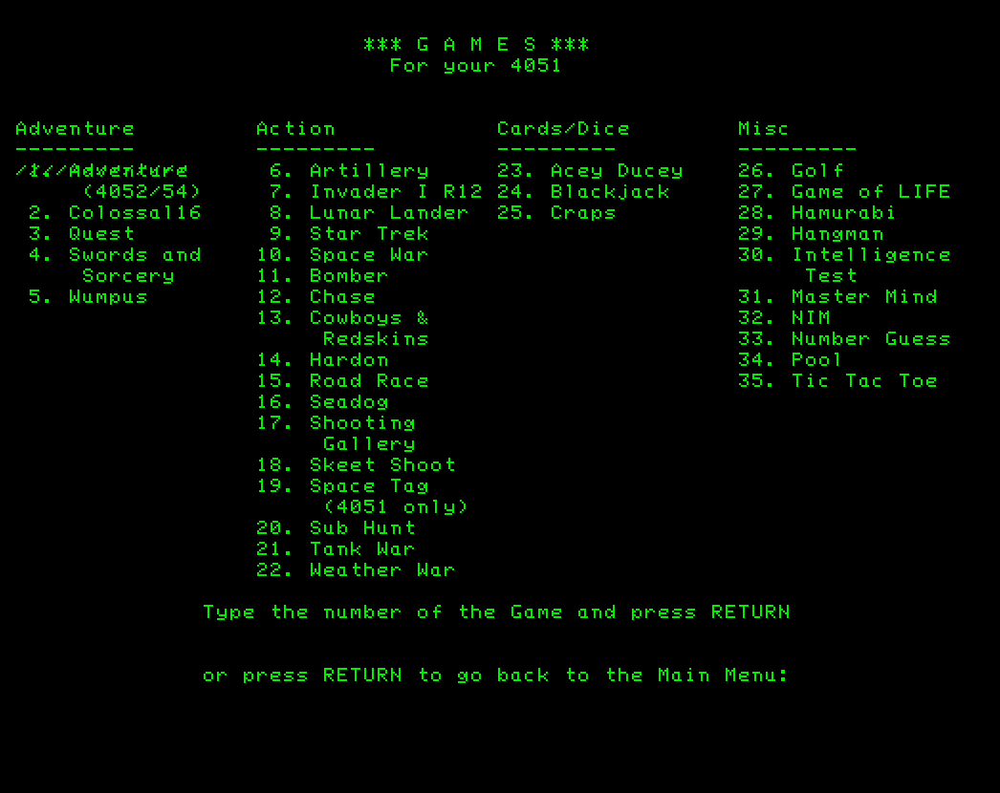

My 4050 GPIB Flash Drive for all the Tektronix 4050 computers is now ready for ordering!!
------------------

--------------------
This Flash Drive replaces your 4050 internal tape drive and allows you to enjoy all your programs - plus my github repository programs, without requiring any 4050 ROM Pack.
--------------
See my Flash Drive thread on vcfed.org for more details: 
https://forum.vcfed.org/index.php?threads/tektronix-405x-gpib-flash-drive.64990/post-1259989

My 4050 Flash Drive does NOT require any ROM Pack for use, but does require minor modifications to programs that were designed for the internal tape drive.

The primary modification to FIND, OLD, SAVE, INPUT, PRINT, READ and WRITE statements would be to add the @5: GPIB address of the Flash Drive to those commands.  

The Flash Drive supports multiple directories on the FAT32 formatted MicroSD card, which uses a PRINT @5,9:"folder name" command to the Flash Drive to change the directory from the current directory (default "ROOT") to an existing directory on the microSD card.

Note that some programs - such as the Fast Graphics / R12 Pictures requires the R12 ROM Pack - Either the vintagetek.org MaxiROM for the 4051 or Jos Dreesen's Multi-Function ROM Pack for the 4052/4054 and A-Series 4052/4054.

Tektronix 4051 MaxiRom is currently available on EBAY from its developer: vintagetek.org and provides Tektronix 4051 with all the 4051 Option ROMs including R12 Graphics and Music.

Jos' MFM ROM Pack for the 4052/4054 emulates an 8-slot 4050E01 ROM Expander and includes a TransEra-741 Real-Time-Clock plus a 4052 RS-232 Printer Interface!  I have used the Real-Time-Clock to automatically boot my 4052 into the Pictures Menu (you can easily pick your own program for boot).  Jos' MFM ROM Pack for the 4052/4054 is available - contact him on his vcfed.org thread: 
https://forum.vcfed.org/index.php?threads/tektronix-4052-4054-multifunction-modules-available.76192/post-76192

Here are screenshots of the Picture Menu and the Games Menu.

