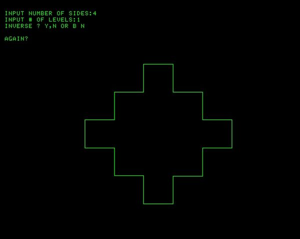
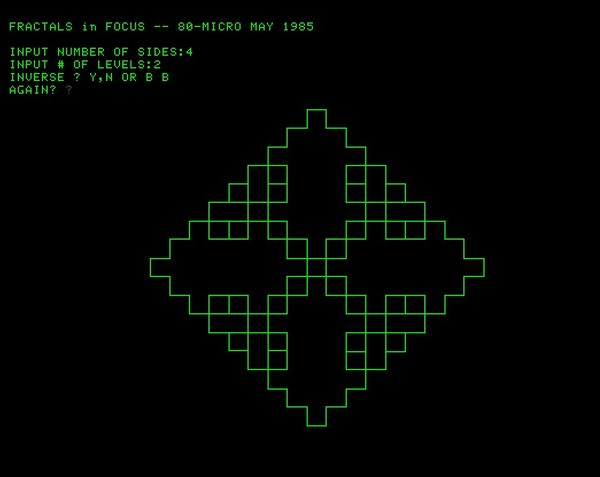

Here are several screenshots running the Fractals in Focus program
-------------------------------------------------
)

The above screenshots are from the Tektronix 405x Emulator

The photo is from my 4054A computer running 5-Sides, 4-Levels, Both

