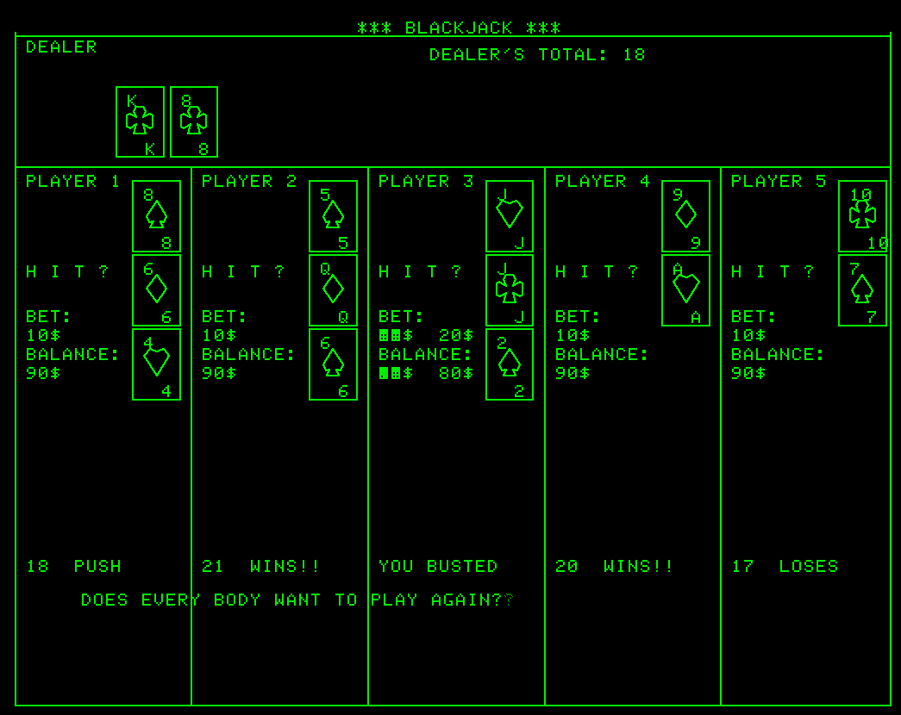

NEW Blackjack Game!
------------
Recovered from old games tape that may have been a Tektronix DEMO tape

Supports 1 to 5 Players against the Dealer(computer)

When it is your turn, HIT? is displayed in front of your cards:
   Press **User Definable Key 1 to take a HIT**
or Press **User Definable Key 6        to PASS**
or Press **User Definable Key 10       to Double-down** your bet on two 10 point cards, your next card is dealt down and will be revealed after all players have completed their turn.

Resulting Balances for all players is displayed after everyone quits the game:

