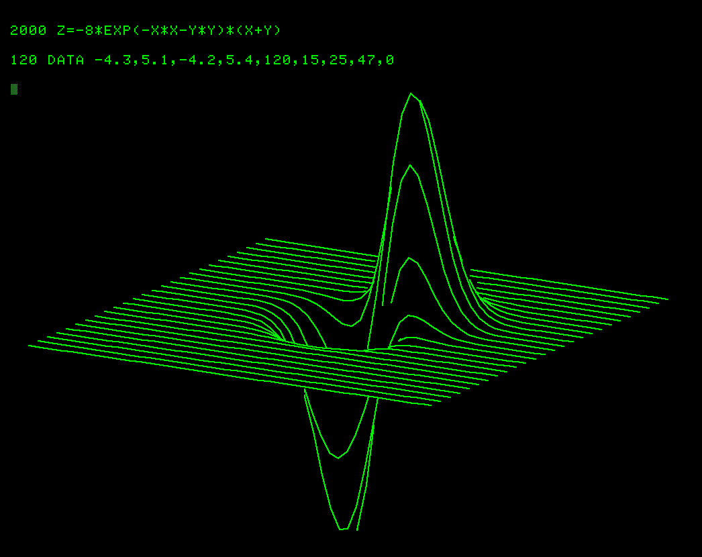

# **General Function Plot Z=F(X,Y) and 3D Function Plot by Dony Robert**

_3D Function Plot_ program was recovered from Tektronix 4050 Education/Research Tape T2 062-5983-01 file 2.  This program will run in 8KB of RAM.  Here is the 3D Function Plot abstract:

I am still searching for the _General Function Plot_ program which requires 32KB of RAM according to the abstract.  I may have to recreate the program from the flowcharts in the General Function Plot PDF.  General Function Plot program requires 32KB of RAM.  Here is the General Function Plot abstract:

-----

Here is the output of running the _CASE 2_ plot using the _3D Function Plot_ BASIC program on the Tektronix 4051 Emulator:

and here is the CASE 2 example run with the General Function Plot program for comparison with the 3D Function Plot program output:

