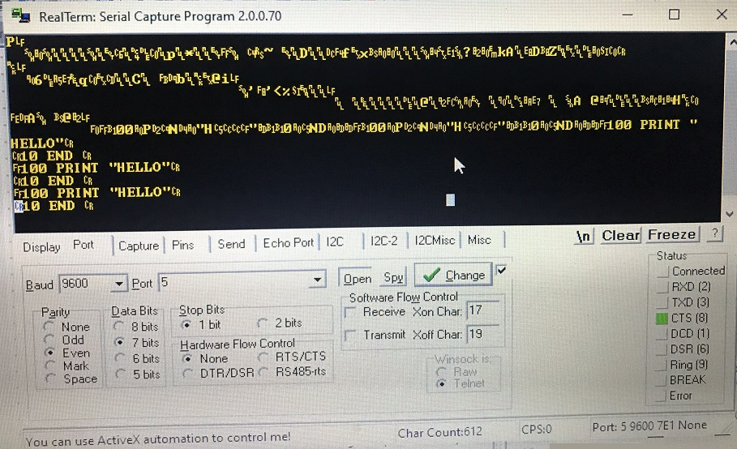

Directory with test ROM images and screenshots from Jos Dreesen's Multifunction ROM Pack
---
This screenshot is Realterm software, showing connection baud rate
I have several crossover cables connecting the MFM to PC USB Serial converter and haven't reproduced this success yet (as of Oct 5 2020)

---
Download CRCDUMP-MFM18.txt and run with Jos' Diagnostic ROM Pack in the left slot to see MFM ROM CRCs
---
CRCDUMP-MFM18.txt runs with Jos' Diagnostic ROM pack in the left slot and Jos' Multifunction Module in right slot.
This adds the CRC checks for MFM or ROM Expander slots.

---
My hypothesis on why the MFM in 4052 right slot is reported in the left slot is the 4052 Opt1 Comm Backpack has BSX reversed between left and right slots
MFM18.BIN is my latest ROM image including the corrected File Manager-01 ROMs.

If you put the Diag ROM in the MFM slot 1 - you can only use it with the CRCDUMP6 to display your BASIC ROM CRCs.

You cannot use the Diag ROM in MFM slot 1 with CRCDUMP18MFM, I suspect because the Diag ROM hardcodes itself to bankswitch to the true LEFT slot NOT the Slot 1 in an expander.
