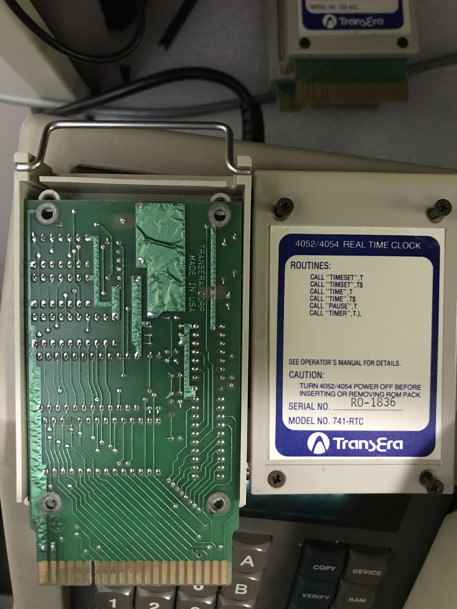

My **TransEra 741 RTC Real Time Clock Super ROM Pack** contained one 2732A-3 4KB EPROM Real Time Clock logic. 

I used HxD to import the .MOT (Motorola format 82), and save each of the three files as a .BIN file.  

