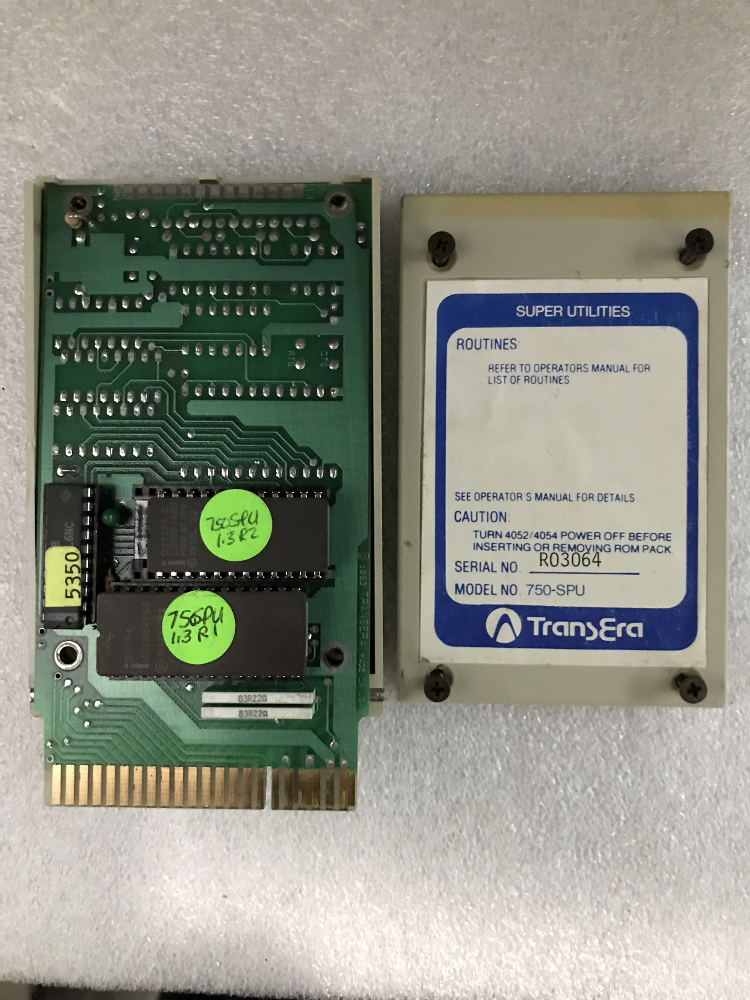

My **TransEra 750 Super Utilities ROM Pack** contained one 2732A-3 4KB EPROM and one 2764 8KB EPROM. 

I used HxD to import the .MOT (Motorola format 82), and save each of the three files as a .BIN file.  

