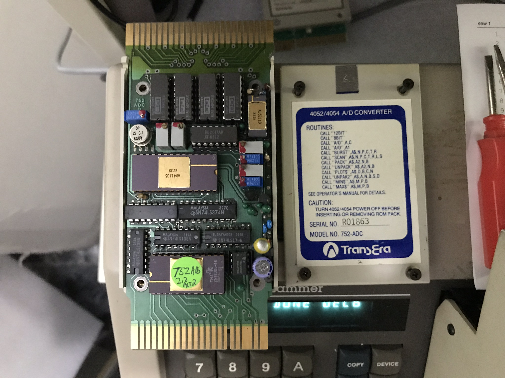

My **TransEra 752 ADC Analog to Digital Converter ROM Pack** contained one 2532-35 4KB EPROM and a 16-channel 12-bit Burr-Brown A/D converter logic. 

I used HxD to import the .MOT (Motorola format 82), and save each of the three files as a .BIN file.  

